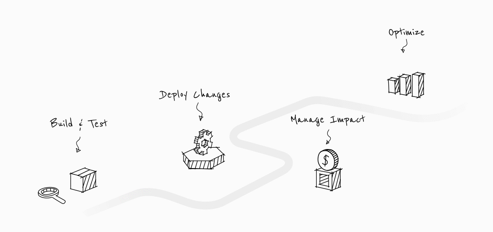

# Harness plugins for [Backstage](https://backstage.io)

<!-- Add when Repository is Open Source. -->
<!--  -->

## About

This project consists of Backstage plugins to integrate with [Harness](https://harness.io) modules on the [Backstage Developer Platform](https://backstage.io). If you are a Harness user and have Backstage as your Internal Developer Portal, try out our plugins for a seamless Developer Experience for your developers.

Harness plugins for Backstage is an Open Source project. It's open for your ideas, suggestions and contributions.

## How to use?

Check out the plugin specific installation instructions.

| Harness Module                                                                                                                                                                                                                                                                                         | Description                                            | Documentation                                            |
| ------------------------------------------------------------------------------------------------------------------------------------------------------------------------------------------------------------------------------------------------------------------------------------------------------ | ------------------------------------------------------ | -------------------------------------------------------- |
| [ CI](https://harness.io/products/continuous-integration) and [ CD](https://harness.io/products/continuous-delivery) | View builds and pipeline executions for your services. | 📘 [Installation instructions](./plugins/harness-ci-cd/) |

## Contributor License Agreement

In order to clarify the intellectual property license granted with Contributions from any person or entity, Harness Inc. ("Harness") must have a Contributor License Agreement ("CLA") on file that has been read and followed by each contributor, indicating an agreement to the license terms [here](Contributor_License_Agreement.md). This license is for your protection as a Contributor as well as the protection of Harness; it does not change your rights to use your own Contributions for any other purpose.

## Contributing

<!-- Checkout contributing guide -->

Check out our [contributing guide](./docs/Contributing.md) if you would like to contribute suggestions or pull requests.

## Contact

If you would like to chat with us, join the [Harness Community Slack channel](https://join.slack.com/t/harnesscommunity/shared_invite/zt-1k5lupmly-No89okNhRnhBSWQa1o69_Q) and ask a question!

## Roadmap

| Harness Module                                                                                                                                                                                                                                                                                         | Description                                               | Status         |
| ------------------------------------------------------------------------------------------------------------------------------------------------------------------------------------------------------------------------------------------------------------------------------------------------------ | --------------------------------------------------------- | -------------- |
| [ CI](https://harness.io/products/continuous-integration) and [ CD](https://harness.io/products/continuous-delivery) | View builds and pipeline executions for your services.    | ✅ Launched    |
| [ Cloud Cost Management](https://harness.io/products/cloud-cost)                                                                                                                         | Manage and Optimize cloud costs                           | ⏳ Coming soon |
| [ Feature Flags](https://harness.io/products/feature-flags)                                                                                                                                   | Manage feature flags                                      | ⏳ Coming soon |
| [ Chaos Engineering](https://harness.io/products/chaos-engineering)                                                                                                                                 | Improve application resiliency and reduce costly downtime | ⏳ Coming soon |
| [ Security Testing Orchestration](https://harness.io/products/security-testing-orchestration)                                                                                                                       | Shift-left application security                           | ⏳ Coming soon |
| [ Service Reliability Management](https://harness.io/products/service-reliability-management)                                                                                                                       | SLO-driven software delivery                              | ⏳ Coming soon |

## Code of Conduct

All users and contributors of the Harness community should adhere to the following [Code of Conduct](https://github.com/harness/community/blob/main/CODE_OF_CONDUCT.md)!

## Communication

Refer [Harness Community Communications Guide](https://github.com/harness-community/overview/blob/main/community_communication_guide.rst) to interact with the wider community users/contributors, join slack workgroups to get help/help other users and create topics in [community.harness.io](https://community.harness.io/).

## Security

Please report sensitive security issues via [harness.io/security](https://harness.io/security) rather than GitHub.

### License

Apache License 2.0. See [COPYING](LICENSE.md) for more information.
