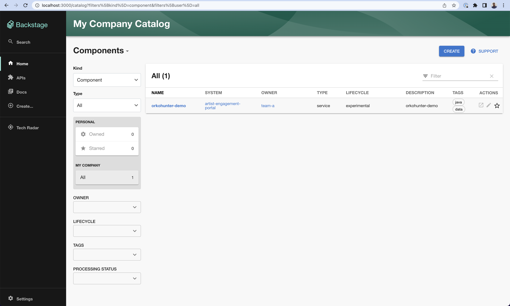
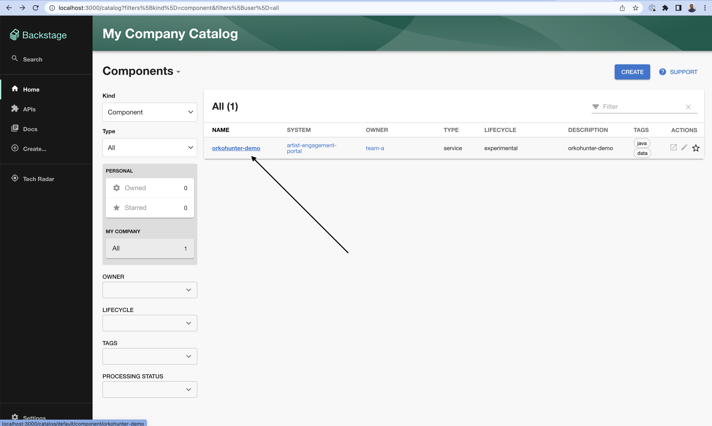
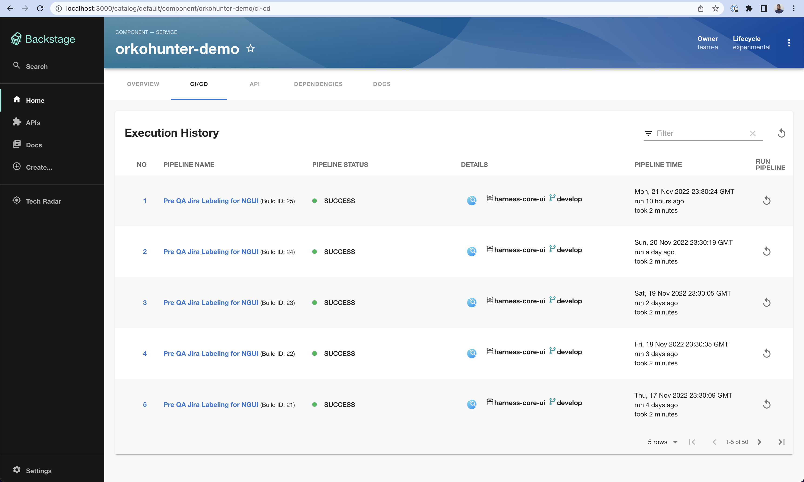

# Contributing to Harness plugins for Backstage

Thank you for choosing to contribute to the project. Contributions are welcome and are greatly appreciated! Every little bit helps, and credit will always be given. ❤️

## Pre-requisites

- Node.js [Active LTS Release](https://nodejs.org/en/blog/release/) and yarn. We recommend using [`nvm`](https://github.com/nvm-sh/nvm) install and manage Node versions.
- [`git`](https://github.com/git-guides/install-git)
- A Harness account (trial account works too). [Get started](https://app.harness.io/auth/#/signup)

## Clone the repository

Start by cloning this repository.

```
git clone https://github.com/harness/backstage-plugins
cd backstage-plugins
```

Install the dependencies and start the project in development mode.

```
yarn install
yarn dev
```

Note: The repository contains a sample Backstage app and backend (in `packages/`) with all the Harness plugins installed. Any changes to the Harness plugins in `plugins/` will be instantly reflected in the Backstage app. This is only for development purposes. Customers are recommended to use the plugins by installing them from NPM in their own instance of Backstage app.

Now go to http://localhost:3000 and see your Backstage app running!



## Contributing to the CI/CD plugin

The [Harness CI/CD plugin](../plugins/harness-ci-cd/) is used by developers to see their latest builds and pipeline executions inside Backstage. Checkout the [README of the plugin](../plugins/harness-ci-cd/README.md) to understand how customers install the plugin.

In order to contribute to the plugin, you need to import a new Software entity inside the Backstage Software Catalog which is connected to a Harness project with at least one CI or CD pipeline.

<!-- TODO: Maybe a simpler Harness tutorial without K8S and delegates. -->

### Create a new or use an existing Harness pipeline

If you already have created Harness pipelines, you don't need to do anything.

You can watch this [video tutorial](https://www.youtube.com/watch?v=RTbgEVgljg4) to create a pipeline in minutes. In this video, you can see how to build a sample pipeline based on Go to help you get started quickly with using Harness CI!

### Create and import a new Backstage software entity

Once you have a Harness project and at least one pipeline with few executions, let's setup Backstage to view those executions. Use the sample [Backstage entity YAML](../examples/catalog-harness-cicd.yaml) to create a new `catalog-info.yaml`. You can create this new YAML file somewhere locally in your computer or remotely on places like GitHub.

In your new entity YAML, replace the `harness.io` annotations under `metadata.annotations` with the details about your project. Checkout the [README of the plugin](../plugins/harness-ci-cd/README.md) to know more about the annotations.

Once your software component YAML is ready, import it inside the Backstage app. There are two ways to do it.

**Option 1: Local entity YAML**

If you created your entity YAML locally, go to the `app-config.yaml` at the project root. Under `catalog.locations`, add a new entry.

```yaml
catalog:
  locations:
    # ... existing imports.
    - type: file
      target: /path/to/your/entity.yaml
```

Note that it is better to use an absolute path. If you are using a relative path like `../../entity.yaml`, keep in mind that the path is relative to the `packages/backend/` directory.

**Option 2: Remote entity YAML**

Open the `http://localhost:300/catalog-import` page in your Backstage app. You can also reach here by clicking `Create` on the left side bar and then clicking "Register Existing Component". Insert a link to your newly created entity YAML file e.g. https://github.com/harness/backstage-plugins/blob/main/examples/catalog-harness-cicd.yaml

## Explore the plugin

That's it! Once you have registered your entity, you should be able to find it on the Home page.



Open it and navigate to the CI/CD tab.


If you have setup the annotations to the Harness project correctly, you'll be able to see pipeline executions for the software component!



Now navigate to `plugins/harness-ci-cd` to make any code changes. The changes will be reflected in your browser. Once you have made the changes, raise a Pull Request on this repository!

If you are stuck anywhere and have a few questions, don't hesitate to reach out to us on the [Harness Community Slack workspace](https://join.slack.com/t/harnesscommunity/shared_invite/zt-1k5lupmly-No89okNhRnhBSWQa1o69_Q).

Happy contributing!
