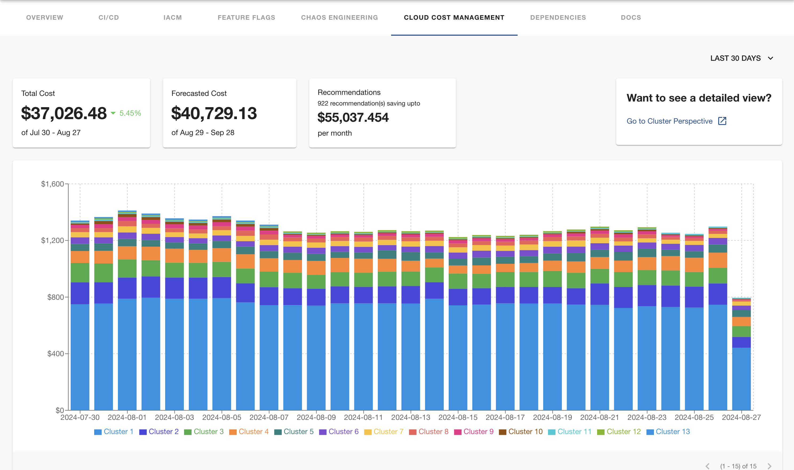

# Harness Cloud Cost Management Plugin

Website: [https://harness.io/](https://harness.io/)

Welcome to the Harness CCM plugin for Backstage!

## Screenshots




## Getting started

## Setup steps

1. Open terminal and navigate to the _root of your Backstage app_. Then run

```
yarn add --cwd packages/app @harnessio/backstage-plugin-ccm

yarn install
```

If you are looking to get started with Backstage, check out [backstage.io/docs](https://backstage.io/docs/getting-started/).

For testing purposes, you can also clone this repository to try out the plugin. It contains an example Backstage app setup which is pre-installed with Harness plugins. However, you must create a new Backstage app if you are looking to get started with Backstage.

2. Configure proxy for harness in your `app-config.yaml` under the `proxy` config. Add your Harness Personal Access Token or Service Account Token for `x-api-key`. See the [Harness docs](https://docs.harness.io/article/tdoad7xrh9-add-and-manage-api-keys) for generating an API Key.

```yaml
# In app-config.yaml

proxy:
  # ... existing proxy settings
  '/harness/prod':
    target: 'https://app.harness.io/'
    headers:
      'x-api-key': '<YOUR PAT/SAT>'
# ...
```

Notes:

- Plugin uses token configured here to make Harness API calls. Make sure the user creating this API token has necessary permissions, which has `perspective view` permission and same applies for service accounts as well it must have a role assigned that has the roles with adequate permissions as described before. 

- Set the value of target to your on-prem URL if you are using the Harness on-prem offering

3. Inside your Backstage's `EntityPage.tsx`, import the `EntityCcmContent` and `isHarnessCcmAvailable`  from `@harnessio/backstage-plugin-ccm` and add `<EntityHarnessCcmContent />`. Something like this -

```tsx
// In packages/app/src/components/catalog/EntityPage.tsx

import {
  isHarnessCcmAvailable,
  EntityCcmContent,
} from '@harnessio/backstage-plugin-ccm';

const ccmContent = (
  // ...
  <EntitySwitch.Case if={isHarnessCcmAvailable}>
    <EntityHarnessCcmContent />
  </EntitySwitch.Case>
  // ...
);
```

4. Add required harness specific annotations to your software component's respective `catalog-info.yaml` file.

Here is an example: [catalog-info-new.yaml](../../examples/catalog-harness-ccm.yaml)
```yaml
apiVersion: backstage.io/v1alpha1
kind: Component
metadata:
  # ...
  annotations:
    # annotation
    harness.io/perspective-url: <harness_ccm_perspective_url>
```

## Features

- Connect a Backstage service with a Harness Perspective and view resources in ways that are more meaningful to your business needs.


