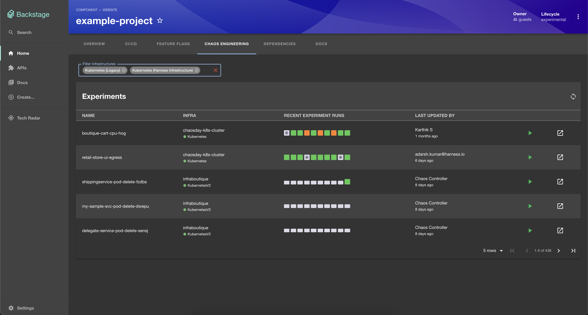
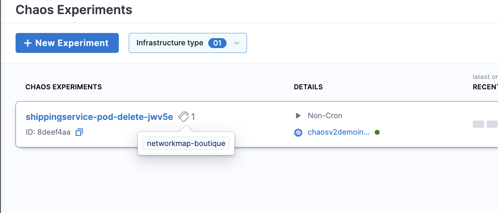

# Harness Chaos Engineering Plugin

Website: [https://harness.io/](https://harness.io/)

Welcome to the Harness Chaos Engineering plugin for Backstage!

## Screenshots



## Setup steps

1. Open terminal and navigate to the _root of your Backstage app_. Then run

```
yarn add --cwd packages/app @harnessio/backstage-plugin-chaos

yarn install
```

If you are looking to get started with Backstage, check out [backstage.io/docs](https://backstage.io/docs/getting-started/).

For testing purposes, you can also clone this repository to try out the plugin. It contains an example Backstage app setup which is pre-installed with Harness plugins. However, you must create a new Backstage app if you are looking to get started with Backstage.

2. Configure proxy for harness in your `app-config.yaml` under the `proxy` config. Add your Harness Personal Access Token or Service Account Token for `x-api-key`. See the [Harness docs](https://docs.harness.io/article/tdoad7xrh9-add-and-manage-api-keys) for generating an API Key.

```yaml
# In app-config.yaml

proxy:
  # ... existing proxy settings
  '/harness':
    target: 'https://app.harness.io/'
    headers:
      'x-api-key': '<YOUR PAT/SAT>'
# ...
```

Notes:

- Plugin uses token configured here to make Harness API calls. Make sure this token has the necessary permissions

- Set the value of target to your on-prem URL if you are using the Harness on-prem offering

3. Inside your Backstage's `EntityPage.tsx`, update the `chaosContent` component to render `<EntityHarnessChaosContent />` whenever the service/project is using Harness Chaos Engineering. Something like this -

```tsx
// In packages/app/src/components/catalog/EntityPage.tsx

import {
  EntityHarnessChaosContent,
  isHarnessChaosAvailable,
} from '@harnessio/backstage-plugin-harness-chaos';

...

const chaosContent = (
  <EntitySwitch>
    <EntitySwitch.Case if={isHarnessChaosAvailable}>
      <EntityHarnessChaosContent />
    </EntitySwitch.Case>

    <EntitySwitch.Case>
      <EmptyState
        title="No Chaos data available for this entity"
        missing="info"
        description="You need to add an annotation to your component if you want to enable Chaos for it. You can read more about annotations in Backstage by clicking the button below."
        action={
          <Button
            variant="contained"
            color="primary"
            href="https://backstage.io/docs/features/software-catalog/well-known-annotations"
          >
            Read more
          </Button>
        }
      />
    </EntitySwitch.Case>
  </EntitySwitch>
);

...

const serviceEntityPage = (
  <EntityLayout>
    <EntityLayout.Route path="/chaos" title="Chaos Engineering">
      {chaosContent}
    </EntityLayout.Route>
  </EntityLayout>
);

...

```

4. Add required harness specific annotations to your software component's respective `catalog-info.yaml` file. (optional)

By default, all the chaos experiments will be fetched from the provided project url, providing optional annotations will fetch experiments for a specific application map.

Based upon the annotations that the user provides, we decide which version of experiments table to show.

##### Chaos V1:
- scoped to all infrastructure (lists all experiments)
- only requires project-url annotations

##### Chaos V2:
 - based on services/application-maps tags (lists experiments scoped to a service tag or a application map tag)
- requires project-url annotations AND either service-tag(s) or network-tag(s)

For ease of use of the user, we check if project url is provided and then see if the service tag or network tag is provided.
If only the project url is provided we default to V1 table that shows experiments for all infrastructures else if we see the other annotations also, we show service specific or application map specific experiments.

> NOTE: service tag based filtering will be available at a later date.

> NOTE: Locating a application map tag



Here is an example: [catalog-info.yaml](../../examples/catalog-harness-chaos.yaml)

```yaml
apiVersion: backstage.io/v1alpha1
kind: Component
metadata:
  # ...
  annotations:
    # mandatory annotation
    harness.io/project-url: <harness_project_url>

    # optional annotations
    harness.io/application-map-tags: |
      <nm-name_1>: <nm-label_1>
      <nm-name_2>: <nm-label_2>

spec:
  type: service
  # ...
```


## Other configurations

- (Optional) Harness URL

If you have a separate Harness hosted URL other than `https://app.harness.io`, you can configure `baseUrl` for `harness` in `app-config.yaml` This step is optional. The default value of `harness.baseUrl` is https://app.harness.io/

```yaml
# In app-config.yaml

harness:
  baseUrl: https://app.harness.io/
```

## Features

- Connect a Backstage service with a Harness project and view all the chaos experiments associated with that project.
- Add network-map tags to view targeted chaos experiments for a specific service/application map.
- Support for various infrastructure filters on the go.
- See details for last 10 runs such as resilience score, status and cron schedules.
- Directly run a chaos experiment from the dashboard itself.
- One click redirect to run details and infrastructure management screens.
