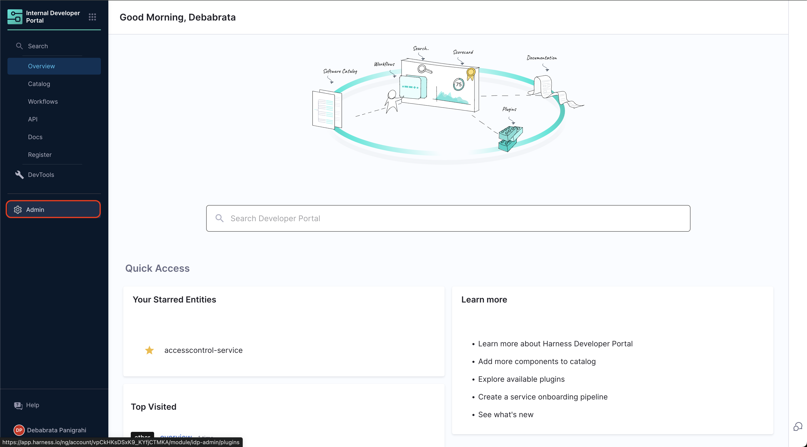
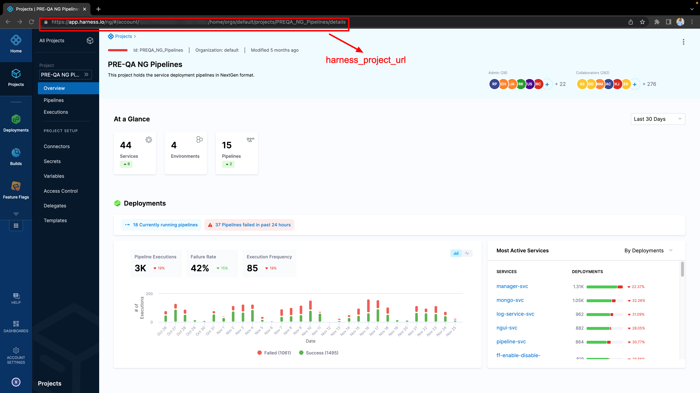
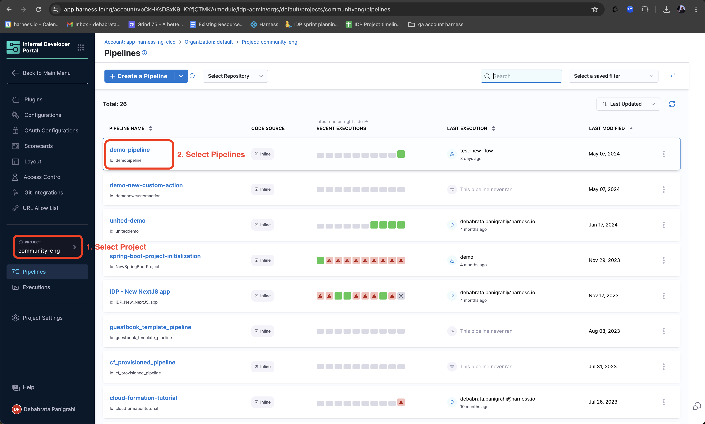
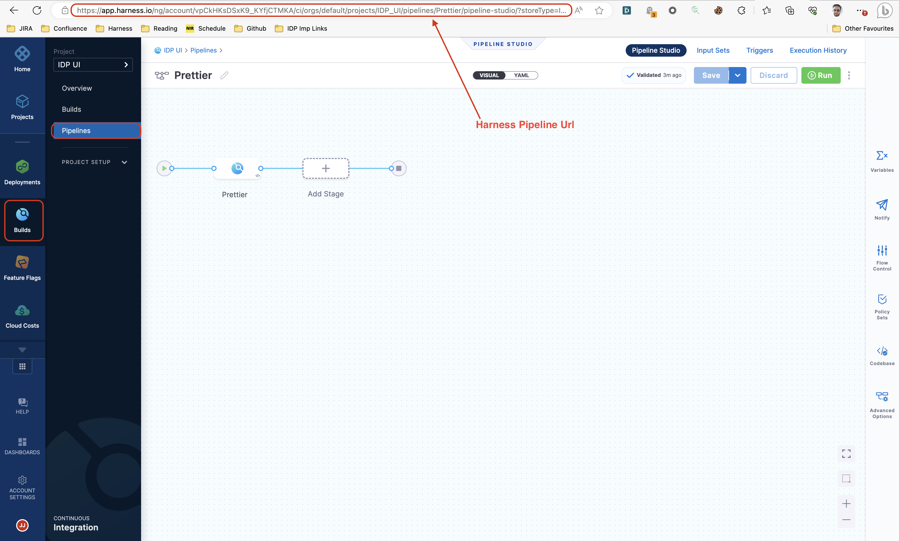
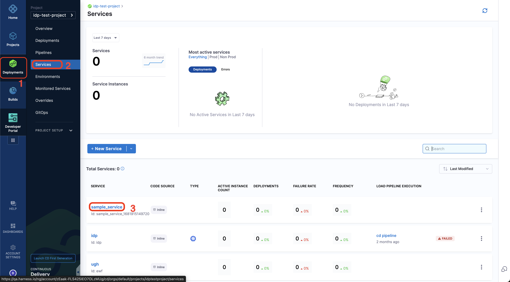
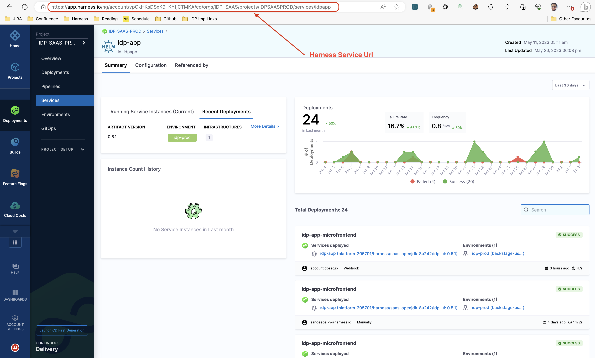
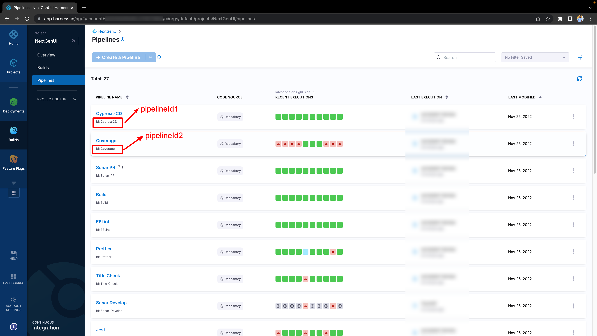
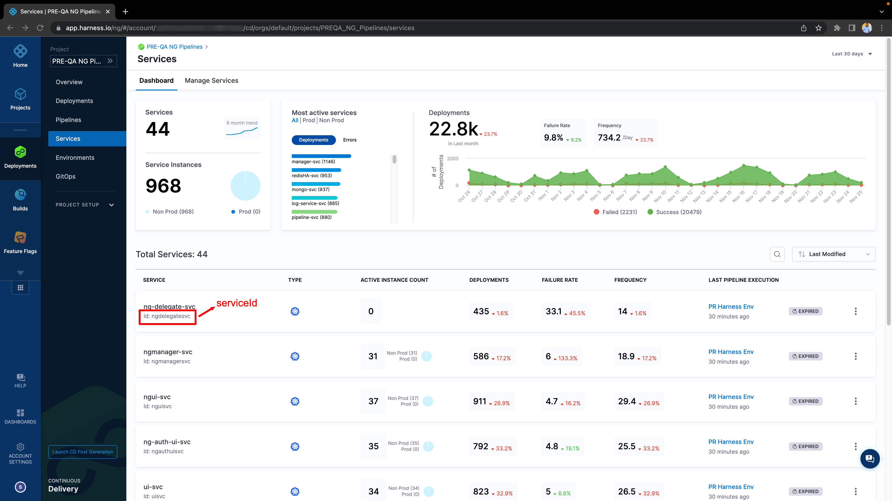

# Conifgurations for HARNESS-CI/CD Plguin

## harness.io/project-url configuration:

## harness.io/pipelines configuration

## harness.io/services configuration

## harness.io/ci-pipelineIds configuration:

## harness.io/cd-serviceId configuration:

