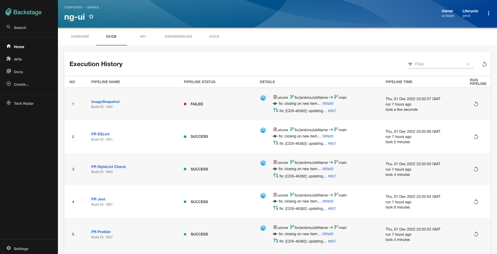
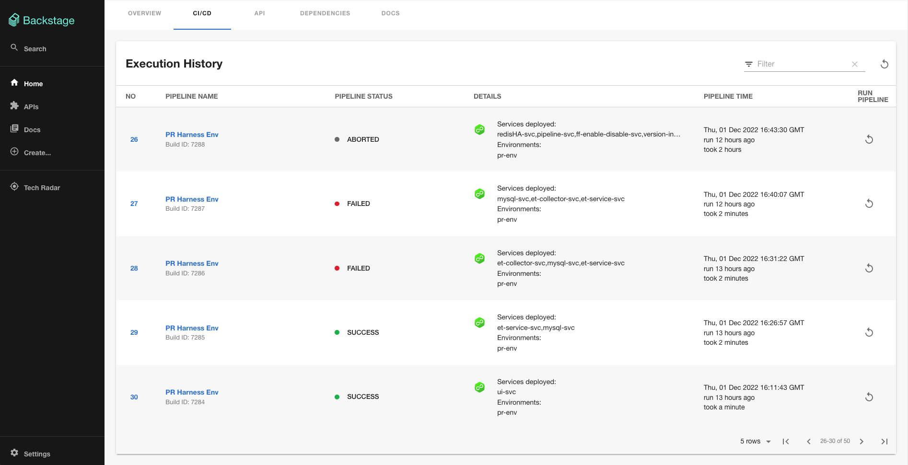
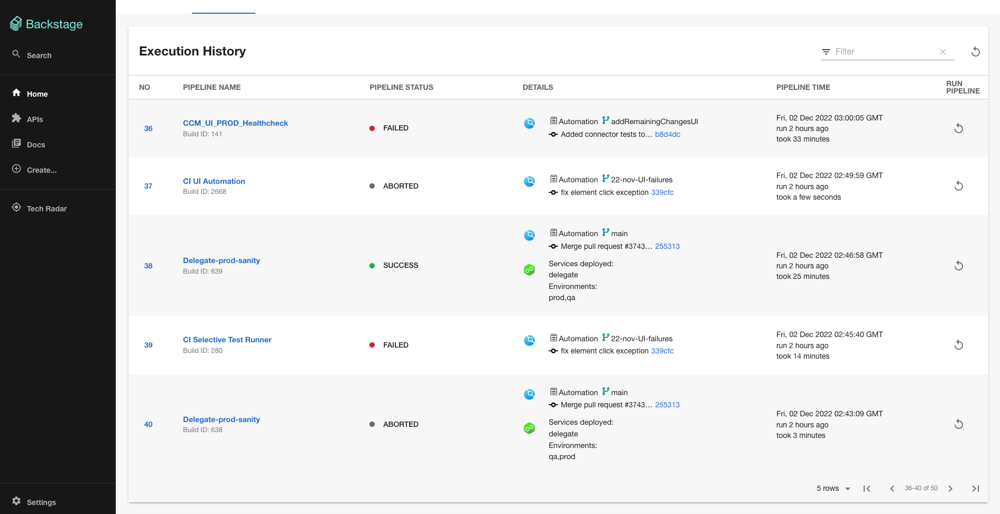

# harness-ci-cd
Website: [https://harness.io/](https://harness.io/)

Welcome to the Harness NextGen CI/CD plugin for Backstage!

## Screenshots






## Getting started

## Setup steps

1. If you have a standalone app(you didn't clone this repo), then do

```
# From your Backstage root directory
yarn add --cwd packages/app @harnessio/backstage-plugin-ci-cd
yarn install
```

2. Configure proxy for harness in `app-config.yaml` under proxy config. Add your Harness Personal Access Token or Service Account Token for `x-api-key` (see the [Harness docs](https://docs.harness.io/article/tdoad7xrh9-add-and-manage-api-keys) )

```yaml
# In app-config.yaml

proxy:
# ...
  '/harness':
    target: 'https://app.harness.io/'
    headers:
      'x-api-key': '<YOUR PAT/SAT>'
# ...      
```
Note: Plugin uses token configured here to make Harness API calls. Make sure this token has the necessary permissions.

3. Inside your `EntityPage.tsx`, update the `cicdContent` to render `<EntityHarnessCiCdContent />` whenever service is using Harness CI/CD. Example below

```tsx
// In packages/app/src/components/catalog/EntityPage.tsx

import {
  isHarnessCiCdAvailable,
  EntityHarnessCiCdContent
} from '@harnessio/backstage-plugin-ci-cd';

const cicdContent = (
  // ...
  <EntitySwitch.Case if={isHarnessCiCdAvailable}>
    <EntityHarnessCiCdContent />
  </EntitySwitch.Case>
  // ...
);
```
Note: If you have separate providers for CI and CD apart from Harness, you need to add a new tab for Harness CI/CD plugin like below instead of replacing your existing CI/CD tab mentioned in above block.
```tsx
// In packages/app/src/components/catalog/EntityPage.tsx

import {
  isHarnessCiCdAvailable,
  EntityHarnessCiCdContent
} from '@harnessio/backstage-plugin-ci-cd';

const serviceEntityPage = (
  // ...
  <EntityLayout.Route path="/harness-ci-cd" title="Harness CI/CD" if={isHarnessCiCdAvailable}>
      <EntityHarnessCiCdContent />
    </EntityLayout.Route>
  // ...
);  
```

4. Configure baseUrl for harness in `app-config.yaml`

```yaml
# In app-config.yaml

harness:
  baseUrl: https://app.harness.io/
```

5. Add required harness specific annotations to your respective catalog-info.yaml files,
   (example: https://github.com/harness/backstage-plugins/blob/main/examples/catalog-harness-cicd.yaml)

```yaml
apiVersion: backstage.io/v1alpha1
kind: Component
metadata:
  # ...
  annotations:
    # mandatory annotations
    harness.io/project-url: <harness_project_url>
   
    # optional annotations
    harness.io/ci-pipelineIds: <pipelineId1,pipelineId2,pipelineId3 etc>
    harness.io/cd-serviceId: <serviceId>
spec:
  type: service
  # ...
```
Note: Refer to [this](./PluginConfiguation.md) page on how to get these values from your Harness account.

## Features

- List top 50 pipeline executions for a configured project/pipelineIds/serviceId
- Pipeline execution status
- Retry pipeline execution
- Pagination for builds
- Works for both personal access tokens and service account token
