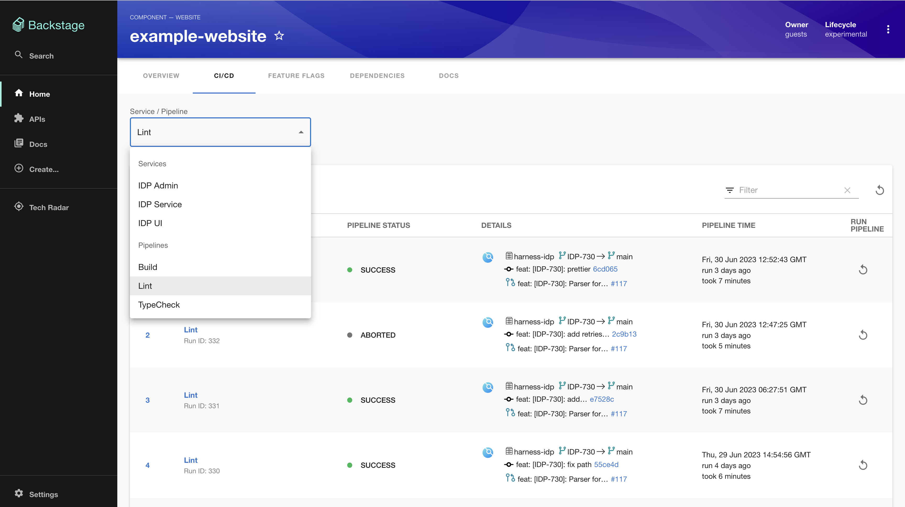
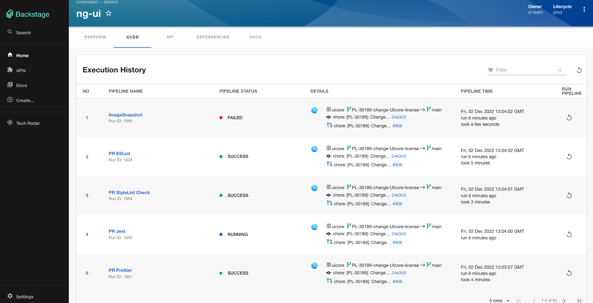
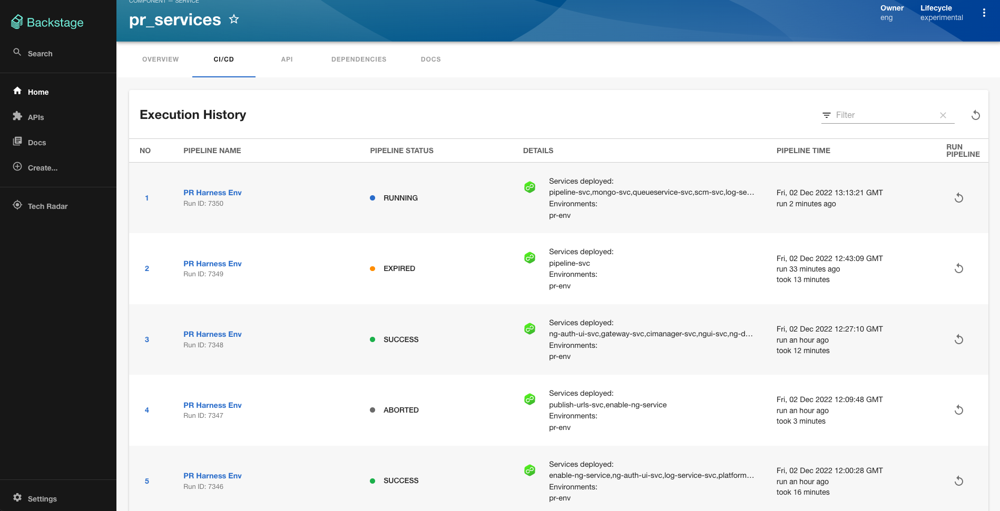
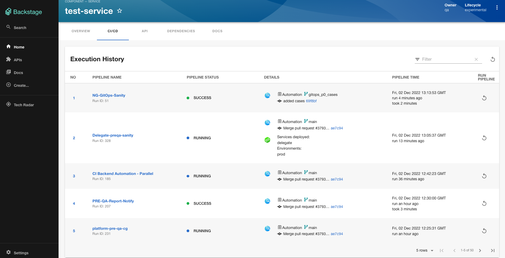

# Harness NextGen CI/CD plugin

Website: [https://harness.io/](https://harness.io/)

Welcome to the Harness NextGen CI/CD plugin for Backstage!

## Screenshots






## Getting started

We have video tutorial for the plugin.

[](http://www.youtube.com/watch?v=XDNdInYwiuw)

## Setup steps

1. Open terminal and navigate to the _root of your Backstage app_. Then run

```
yarn add --cwd packages/app @harnessio/backstage-plugin-ci-cd

yarn install
```

If you are looking to get started with Backstage, check out [backstage.io/docs](https://backstage.io/docs/getting-started/).

For testing purposes, you can also clone this repository to try out the plugin. It contains an example Backstage app setup which is pre-installed with Harness plugins. However, you must create a new Backstage app if you are looking to get started with Backstage.

2. Configure proxy for harness in your `app-config.yaml` under the `proxy` config. Add your Harness Personal Access Token or Service Account Token for `x-api-key`. See the [Harness docs](https://docs.harness.io/article/tdoad7xrh9-add-and-manage-api-keys) for generating an API Key.

```yaml
# In app-config.yaml

proxy:
  # ... existing proxy settings
  '/harness/prod':
    target: 'https://app.harness.io/'
    headers:
      'x-api-key': '<YOUR PAT/SAT>'
# ...
```

Notes:

- Plugin uses token configured here to make Harness API calls. Make sure the user creating this API token has necessary permissions, which include `project view` permission along with `pipeline view` and `execute` permissions and same applies for service accounts as well it must have a role assigned that has the roles with adequate permissions as described before.

- Set the value of target to your on-prem URL if you are using the Harness on-prem offering

3. Inside your Backstage's `EntityPage.tsx`, update the `cicdContent` component to render `<EntityHarnessCiCdContent />` whenever the service is using Harness CI/CD. Something like this -

```tsx
// In packages/app/src/components/catalog/EntityPage.tsx

import {
  isHarnessCiCdAvailable,
  EntityHarnessCiCdContent,
} from '@harnessio/backstage-plugin-ci-cd';

const cicdContent = (
  // ...
  <EntitySwitch.Case if={isHarnessCiCdAvailable}>
    <EntityHarnessCiCdContent />
  </EntitySwitch.Case>
  // ...
);
```

Note: If you have separate providers for CI and CD apart from Harness, you need to add a new tab for Harness CI/CD plugin like below instead of replacing your existing CI/CD tab mentioned above.

<details>
  <summary>Instructions in case of separate CI and CD provider (Click to expand)</summary>

```tsx
// In packages/app/src/components/catalog/EntityPage.tsx

import {
  isHarnessCiCdAvailable,
  EntityHarnessCiCdContent,
} from '@harnessio/backstage-plugin-ci-cd';

const serviceEntityPage = (
  // ...
  <EntityLayout.Route
    path="/harness-ci-cd"
    title="Harness CI/CD"
    if={isHarnessCiCdAvailable}
  >
    <EntityHarnessCiCdContent />
  </EntityLayout.Route>
  // ...
);
```

</details>

4. Add required harness specific annotations to your software component's respective `catalog-info.yaml` file.

Here is an example: [catalog-info-new.yaml](../../examples/catalog-harness-cicd-new.yaml)

```yaml
apiVersion: backstage.io/v1alpha1
kind: Component
metadata:
  # ...
  annotations:
    # optional annotation
    harness.io/pipelines: |
      labelA: <harness_pipeline_url>
      labelB: <harness_pipeline_url>
    # here labelA / labelB denotes the value you will see in dropdown in execution list. Refer screentshot 1
    # optional annotation
    harness.io/services: |
      labelA: <harness_service_url>
      labelB: <harness_service_url>
spec:
  type: service
  # ...
```

#### Old Annotation

Here is an example: https://github.com/harness/backstage-plugins/blob/main/examples/catalog-harness-cicd.yaml

```yaml
apiVersion: backstage.io/v1alpha1
kind: Component
metadata:
  # ...
  annotations:
    # mandatory annotation
    harness.io/project-url: <harness_project_url>

    # optional annotations
    # harness.io/ci-pipelineIds: <pipelineId1,pipelineId2,pipelineId3 etc>
    # harness.io/cd-serviceId: <serviceId>
spec:
  type: service
  # ...
```

Note: If new annotation is present then old annotation will be ignored for that particular catalog.  
Note: Refer to [this](./PluginConfiguation.md) page on how to get these values from your Harness account.

By default, the plugin will take all the pipelines inside the configured Harness project and show their executions. However, if your service has quiet a few pipelines, you can additionally configure the pipelines as well as associated services to show those specific execution details for the display.

## Other configurations

- (Optional) Harness URL

If you have a separate Harness hosted URL other than `https://app.harness.io`, you can configure `baseUrl` for `harness` in `app-config.yaml` This step is optional. The default value of `harness.baseUrl` is https://app.harness.io/

```yaml
# In app-config.yaml

harness:
  baseUrl: https://app.harness.io/
```

- Enable/Disable re-run pipelines feature

By default, Backstage users will be able to re-run pipelines from the plugin. However, if your Backstage app doesn't have a good RBAC policy, users can technically re-run pipelines for any service. Due to this, we have a way to disable the re-run pipeline feature. You can do this by configuring `harness.disableRunPipeline`.

```yaml
# app-config.yaml

harness:
  # (Optional) Change it true to remove "Run Pipeline" option on the pipeline executions table
  disableRunPipeline: false
```

## Features

- Connect a Backstage service with a Harness project and view top 50 executions from the pipelines in the project.
- See details about executions - status, execution timestamp and time taken, associated triggers for CI pipelines, services deployed for CD pipelines.
- Specify pipeline IDs (CI) or service IDs (CD) to narrow down on pipeline executions to show in the Backstage service view.
- Retry pipeline executions from the plugin

## Upcoming features

Checkout the [next milestone](https://github.com/harness/backstage-plugins/milestones) for the CI/CD plugin to learn about the planned features. If you have some ideas and want to give feedback, feel free to create a [new GitHub issue](https://github.com/harness/backstage-plugins/issues/new/choose) and suggest a feature request.
