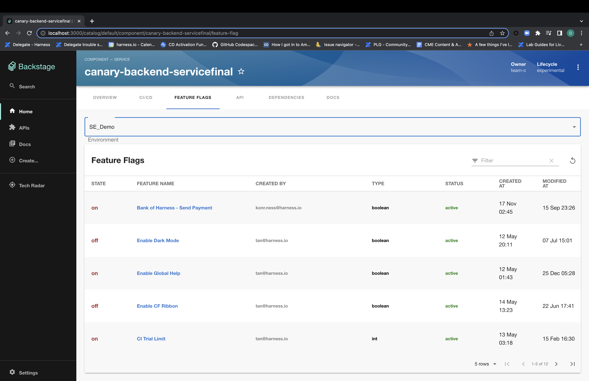

# Harness Feature Flags Plugin

Website: [https://harness.io/](https://harness.io/)

Welcome to the Harness Feature Flags plugin for Backstage!

## Screenshots




## Setup steps

1. Open terminal and navigate to the _root of your Backstage app_. Then run

```
yarn add --cwd packages/app @harnessio/backstage-plugin-feature-flags

yarn install
```

If you are looking to get started with Backstage, check out [backstage.io/docs](https://backstage.io/docs/getting-started/).

For testing purposes, you can also clone this repository to try out the plugin. It contains an example Backstage app setup which is pre-installed with Harness plugins. However, you must create a new Backstage app if you are looking to get started with Backstage.

2. Configure proxy for harness in your `app-config.yaml` under the `proxy` config. Add your Harness Personal Access Token or Service Account Token for `x-api-key`. See the [Harness docs](https://docs.harness.io/article/tdoad7xrh9-add-and-manage-api-keys) for generating an API Key.

```yaml
# In app-config.yaml

proxy:
  # ... existing proxy settings
  '/harness':
    target: 'https://app.harness.io/'
    headers:
      'x-api-key': '<YOUR PAT/SAT>'
# ...
```

Notes:

- Plugin uses token configured here to make Harness API calls. Make sure this token has the necessary permissions

- Set the value of target to your on-prem URL if you are using the Harness on-prem offering

3. Inside your Backstage's `EntityPage.tsx`, add the new `featureFlagList` component to render `<EntityHarnessFeatureFlagContent />` whenever the service is using Harness Feature Flags. Something like this -

```tsx
// In packages/app/src/components/catalog/EntityPage.tsx

import {
  isHarnessFeatureFlagAvailable,
  EntityHarnessFeatureFlagContent,
} from '@harnessio/backstage-plugin-feature-flags';

...

const featureFlagList = (
  <EntitySwitch>
    <EntitySwitch.Case if={isHarnessFeatureFlagAvailable}>
      <EntityHarnessFeatureFlagContent />
    </EntitySwitch.Case>

    <EntitySwitch.Case>
      <EmptyState
        title="No Feature Flags available for this entity"
        missing="info"
        description="You need to add an annotation to your component if you want to enable Feature Flags for it. You can read more about annotations in Backstage by clicking the button below."
        action={
          <Button
            variant="contained"
            color="primary"
            href="https://backstage.io/docs/features/software-catalog/well-known-annotations"
          >
            Read more
          </Button>
        }
      />
    </EntitySwitch.Case>
  </EntitySwitch>
);

...

const serviceEntityPage = (
  <EntityLayout>
    <EntityLayout.Route path="/feature-flag" title="Feature Flags">
      {featureFlagList}
    </EntityLayout.Route>
  </EntityLayout>
);

...

```

4. Add required harness specific annotations to your software component's respective `catalog-info.yaml` file. Here is an example: https://github.com/harness/backstage-plugins/blob/main/examples/catalog-harness-cicd.yaml

```yaml
apiVersion: backstage.io/v1alpha1
kind: Component
metadata:
  # ...
  annotations:
    # mandatory annotation
    harness.io/project-url: <harness_project_url>

    # optional annotations
    # harness.io/ci-pipelineIds: <pipelineId1,pipelineId2,pipelineId3 etc>
    # harness.io/cd-serviceId: <serviceId>
spec:
  type: service
  # ...
```

Note: Refer to [this](./harness-ci-cd/PluginConfiguation.md) page on how to get these values from your Harness account.

By default, the plugin will take all the pipelines inside the configured Harness project and show their executions. However, if your service has quiet a few pipelines, you can additionally configure the pipelines as well as associated services to show those specific execution details for the display.

## Other configurations

- (Optional) Harness URL

If you have a separate Harness hosted URL other than `https://app.harness.io`, you can configure `baseUrl` for `harness` in `app-config.yaml` This step is optional. The default value of `harness.baseUrl` is https://app.harness.io/

```yaml
# In app-config.yaml

harness:
  baseUrl: https://app.harness.io/
```

## Features

- Connect a Backstage service with a Harness project and view the list of all Feature Flags.
- See details about a Feature Flags - state(on/off), type and status environment, last modified and created.
- Filter the Feature Flags and their corresponding information according to the Environments.
