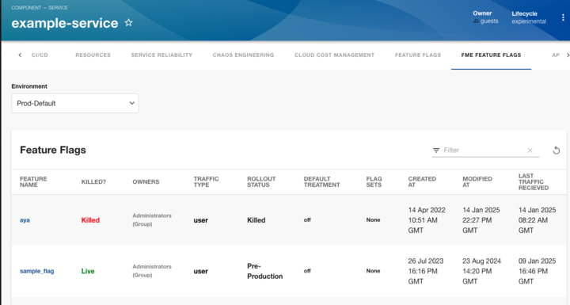

# Harness Feature Flags Plugin

Website: [https://harness.io/](https://harness.io/)

Welcome to the Harness FME Feature Flags plugin for Backstage!

## Screenshots



## Setup steps

1. Open terminal and navigate to the _root of your Backstage app_. Then run

```
yarn add --cwd packages/app @harnessio/backstage-plugin-fme-feature-flags

yarn install
```

If you are looking to get started with Backstage, check out [backstage.io/docs](https://backstage.io/docs/getting-started/).

For testing purposes, you can also clone this repository to try out the plugin. It contains an example Backstage app setup which is pre-installed with Harness plugins. However, you must create a new Backstage app if you are looking to get started with Backstage.

2. Configure proxy for harness in your `app-config.yaml` under the `proxy` config. Add your Harness FME Admin API Key for `Authorization: Bearer`. See the [Harness FME docs](https://help.split.io/hc/en-us/articles/360019916211-API-keys) for generating an API Key.

```yaml
# In app-config.yaml

proxy:
  # ... existing proxy settings
  '/harnessfme':      
    target: 'https://api.split.io/'
    headers:
      'Authorization': 'Bearer <API KEY>'
# ...
```

Notes:

- Plugin uses token configured here to make Harness FME API calls. Make sure this token has the necessary permissions


3. Inside your Backstage's `EntityPage.tsx`, add the new `FMEfeatureFlagList` component to render `<EntityHarnessFMEFeatureFlagContent />` whenever the service is using Harness Feature Flags. Something like this -

```tsx
// In packages/app/src/components/catalog/EntityPage.tsx

import {
  isHarnessFMEFeatureFlagAvailable,
  EntityHarnessFMEFeatureFlagContent,
} from '@harnessio/backstage-plugin-fme-feature-flags';

...

const featureFlagList = (
  <EntitySwitch>
    <EntitySwitch.Case if={isHarnessFMEFeatureFlagAvailable}>
      <EntityHarnessFMEFeatureFlagContent />
    </EntitySwitch.Case>

    <EntitySwitch.Case>
      <EmptyState
        title="No FME Feature Flags available for this entity"
        missing="info"
        description="You need to add an annotation to your component if you want to enable Feature Flags for it. You can read more about annotations in Backstage by clicking the button below."
        action={
          <Button
            variant="contained"
            color="primary"
            href="https://backstage.io/docs/features/software-catalog/well-known-annotations"
          >
            Read more
          </Button>
        }
      />
    </EntitySwitch.Case>
  </EntitySwitch>
);

...

const serviceEntityPage = (
  <EntityLayout>
    <EntityLayout.Route path="/fme-feature-flag" title="FME Feature Flags">
      {FMEList}
    </EntityLayout.Route>
  </EntityLayout>
);

...

```

4. Add required Harness FME specific annotations to your software component's respective `catalog-info.yaml` file. 
You will need your accountId (formerly Org ID) and projectId (formerly Workspace ID)

You can get these from the URL when you are logged in to the FME console.

https://app.split.io/org/<ACCOUNT ID>/ws/<PROJECT ID>>/mywork


```yaml
apiVersion: backstage.io/v1alpha1
kind: Component
metadata:
  # ...
  annotations:
    # mandatory annotation
    harnessfme/projectId: <project id>
    harnessfme/accountId: <account id>

  type: service
  # ...
```


## Features

- Connect a Backstage service with a Harness project and view the list of all Feature Flags.
- See details about a Feature Flags - state(killed/live), trafficType, last modified and created.
- Filter the Feature Flags and their corresponding information according to the Environments.
