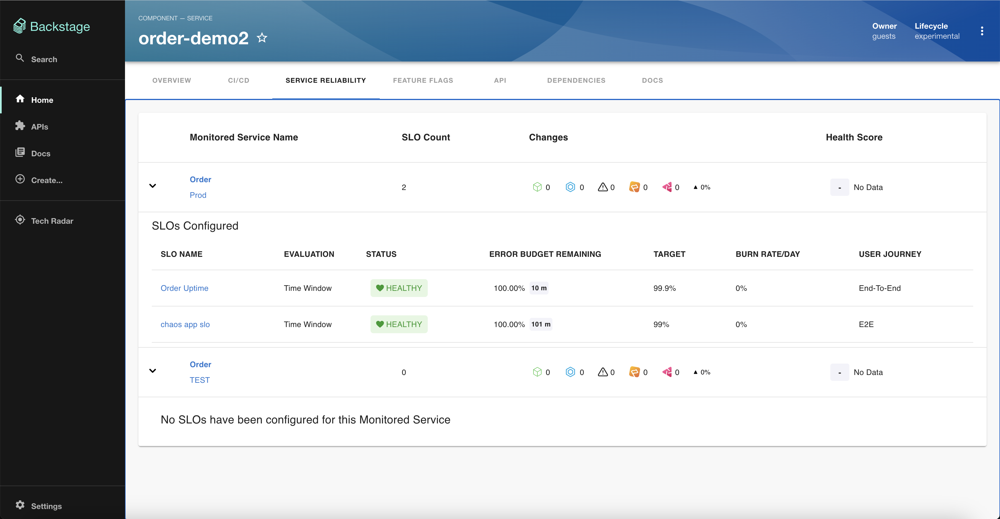

# Harness Service Reliability Management Plugin

Website: [https://harness.io/](https://harness.io/)

Welcome to the Harness Service Reliability Management plugin for Backstage!

## Screenshots



## Setup steps

1. Open terminal and navigate to the _root of your Backstage app_. Then run

```
yarn add --cwd packages/app @harnessio/backstage-plugin-srm

yarn install
```

If you are looking to get started with Backstage, check out [backstage.io/docs](https://backstage.io/docs/getting-started/).

For testing purposes, you can also clone this repository to try out the plugin. It contains an example Backstage app setup which is pre-installed with Harness plugins. However, you must create a new Backstage app if you are looking to get started with Backstage.

2. Configure proxy for harness in your `app-config.yaml` under the `proxy` config. Add your Harness Personal Access Token or Service Account Token for `x-api-key`. See the [Harness docs](https://docs.harness.io/article/tdoad7xrh9-add-and-manage-api-keys) for generating an API Key.

```yaml
# In app-config.yaml

proxy:
  # ... existing proxy settings
  '/harness':
    target: 'https://app.harness.io/'
    headers:
      'x-api-key': '<YOUR PAT/SAT>'
# ...
```

Notes:

- Plugin uses token configured here to make Harness API calls. Make sure this token has the necessary permissions

- Set the value of target to your on-prem URL if you are using the Harness on-prem offering

3. Inside your Backstage's `EntityPage.tsx`, update the `srmContent` component to render `<EntityHarnessSrmContent />` whenever the service is using Harness SRM. Something like this -

```tsx
// In packages/app/src/components/catalog/EntityPage.tsx

import {
  EntityHarnessSrmContent,
  isHarnessSRMAvailable
} from '@harnessio/backstage-plugin-harness-srm';

...

const srmContent = (
  <EntitySwitch>
    <EntitySwitch.Case if={isHarnessSRMAvailable}>
      <EntityHarnessSrmContent />
    </EntitySwitch.Case>

    <EntitySwitch.Case>
      <EmptyState
        title="No SRM available for this entity"
        missing="info"
        description="You need to add an annotation to your component if you want to enable SRM for it. You can read more about annotations in Backstage by clicking the button below."
        action={
          <Button
            variant="contained"
            color="primary"
            href="https://backstage.io/docs/features/software-catalog/well-known-annotations"
          >
            Read more
          </Button>
        }
      />
    </EntitySwitch.Case>
  </EntitySwitch>
);

...

const serviceEntityPage = (
  <EntityLayout>
    <EntityLayout.Route path="/srm" title="Service Reliability">
      {srmContent}
    </EntityLayout.Route>
  </EntityLayout>
);

...

```

4. Add required harness specific annotations to your software component's respective `catalog-info.yaml` file.

Here is an example: [catalog-info.yaml](../../examples/catalog-harness-srm.yaml)
```yaml
apiVersion: backstage.io/v1alpha1
kind: Component
metadata:
  # ...
  annotations:
    harness.io/services: |
      labelA: <harness_service_url>

spec:
  type: service
  # ...
```

## Other configurations

- (Optional) Harness URL

If you have a separate Harness hosted URL other than `https://app.harness.io`, you can configure `baseUrl` for `harness` in `app-config.yaml` This step is optional. The default value of `harness.baseUrl` is https://app.harness.io/

```yaml
# In app-config.yaml

harness:
  baseUrl: https://app.harness.io/
```

## Features

- Connect a Backstage service with a Harness project and view the Monitored Services associated with that service.
- See details about Monitored Service - the changes, health score, and the SLOs asscoiated with it.
- See details about the SLOs like their status, burn rate, target, error budget remaining for a given Monitored Service on clicking the dropdown.


